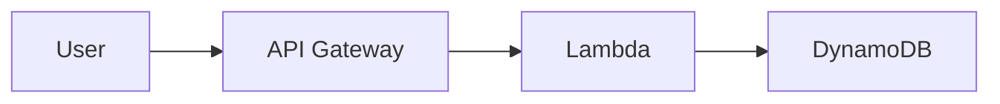
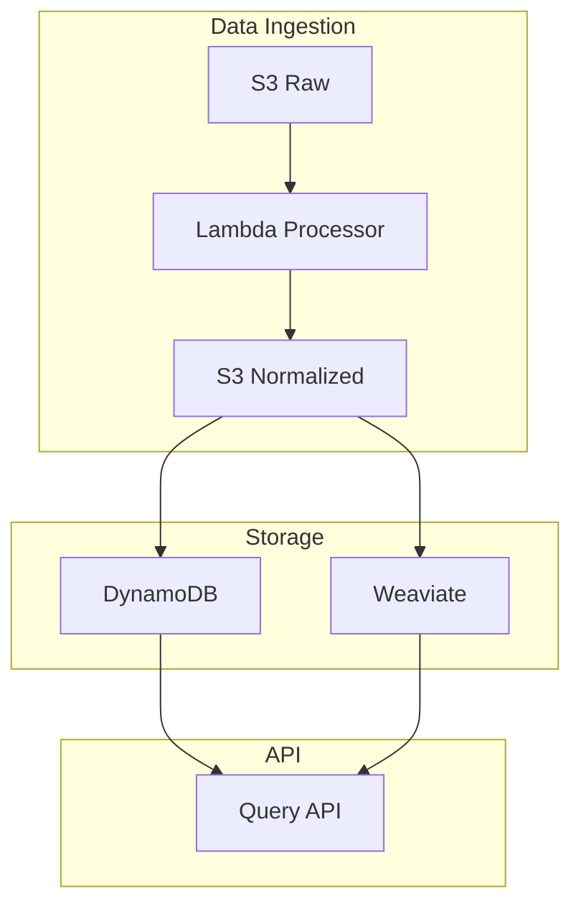
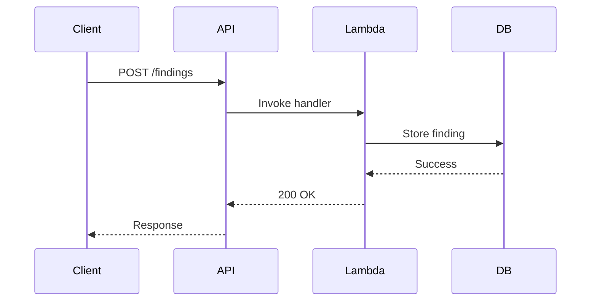

# Documentation Standards

All documentation must follow REF-001 standards from the Neurocipher Standards Catalog.

## Document Structure

### Required Front Matter

Every document must include YAML front matter with these fields:

```yaml
---
id: DOC-TYPE-NNN-Short-Title
title: Full Document Title
owner: Team or Individual
status: Draft | Active | Deprecated
last_reviewed: YYYY-MM-DD
applies_to: [Platform Area or Component]
related:
  - REF-001-Glossary-and-Standards-Catalog
  - Other-Related-Documents
---
```

### Document ID Format

- **REF-NNN**: Reference documents (glossaries, standards)
- **ARC-NNN**: Architecture documents
- **GOV-NNN**: Governance documents
- **DPS-NNN**: Data pipeline service documents
- **SVC-NNN**: Service documents
- **RB-NNN**: Runbooks
- **DR-NNN**: Disaster recovery documents

### Required Header Sections

After the front matter, include these sections:

```markdown
## Status

Current status of the document (Draft, Active, Deprecated)

## Owner

Team or individual responsible for maintaining this document

## Approvers

List of people who must approve changes

## Last Updated

YYYY-MM-DD format

## Applies To

Platform areas or components this document covers

## Related Documents

- Links to related documentation
```

## Content Guidelines

### Writing Style

- **Voice**: Active voice, present tense
- **Headings**: Sentence case (capitalize only first word and proper nouns)
- **Tone**: Professional, clear, concise
- **Audience**: Assume technical audience but explain domain-specific terms

### Formatting Rules

1. **No em dashes**: Use commas, semicolons, or split into separate sentences
2. **Code blocks**: Use fenced code blocks with language specifiers
3. **Links**: Use descriptive link text, not "click here"
4. **Lists**: Use bullet points or numbered lists for multiple items
5. **Tables**: Use Markdown tables with headers

### Diagrams

**Always use Mermaid**, never ASCII art:

```markdown

```

Common diagram types:
- **Sequence diagrams**: For interactions between components
- **Flow charts**: For process flows
- **Architecture diagrams**: For system structure
- **State diagrams**: For state machines

### Examples

#### Good Architecture Diagram



#### Good Sequence Diagram



## Naming Conventions

### File Names

- Use kebab-case: `my-document-title.md`
- Prefix with document ID: `REF-001-Glossary-and-Standards-Catalog.md`
- Avoid spaces, ampersands, and em dashes in filenames

### Directory Structure

```
docs/
├── governance/          # Standards, glossary, governance
├── product/            # PRDs, vision, module mapping
├── architecture/       # Platform and module architecture
├── data-models/        # Schemas, contracts, data governance
├── services/           # Service-level architecture (DPS-*)
├── security-controls/  # Threat models, IAM, network policies
├── ai/                 # Model architecture, guardrails
└── observability/      # Logging, metrics, DR, release strategy
```

## Technical Content

### API Documentation

When documenting APIs:

1. **Endpoint**: HTTP method and path
2. **Description**: What the endpoint does
3. **Parameters**: Query, path, and body parameters
4. **Request example**: Include full request with headers
5. **Response examples**: Success and error responses
6. **Status codes**: All possible response codes

Example:

```markdown
### GET /v1/findings/{id}

Retrieve a specific security finding by ID.

**Path Parameters:**
- `id` (string, required): UUIDv7 of the finding

**Response (200 OK):**
```json
{
  "id": "018fa0b8-6cde-7d2a-bd7f-8d9a3f6f1d0a",
  "severity": "high",
  "title": "Unencrypted S3 bucket",
  "created_at": "2025-11-26T18:00:00Z"
}
```

**Error Responses:**
- `404 Not Found`: Finding does not exist
- `500 Internal Server Error`: Server error
```

### Schema Documentation

When documenting data schemas:

1. **Purpose**: What the schema represents
2. **Fields**: All fields with types and descriptions
3. **Constraints**: Validation rules, required fields
4. **Examples**: Valid example payloads
5. **Versioning**: Version number and change history

### Architecture Decisions

Use Architecture Decision Records (ADRs):

```markdown
## Context

What is the issue we're addressing?

## Decision

What decision did we make?

## Consequences

What are the implications of this decision?
- Positive consequences
- Negative consequences
- Trade-offs
```

## Standards & References

### Data Formats

- **IDs**: UUIDv7 format (e.g., `018fa0b8-6cde-7d2a-bd7f-8d9a3f6f1d0a`)
- **Timestamps**: ISO 8601 with Z suffix (e.g., `2025-11-26T18:00:00Z`)
- **Events**: CloudEvents 1.0 envelope, type naming: `domain.service.event.v{major}`
- **Errors**: RFC 7807 Problem Details

### Service Names

- Format: `svc-{domain}-{function}`
- Examples: `svc-ingest-api`, `svc-normalize`, `svc-embed`

### Environment Names

- Use: `dev`, `stg`, `prod`
- Don't use: "staging", "production", "development"

### AWS Resource Names

- S3 raw: `s3://nc-dp-{env}-raw`
- S3 normalized: `s3://nc-dp-{env}-norm`
- DynamoDB: `nc-dp-{env}-documents`
- KMS: `alias/nc-dp-data-{env}`

## Code Examples in Documentation

### Inline Code

Use backticks for inline code, commands, file names, and short code snippets:
- Function names: `calculate_risk_score()`
- File names: `openapi.yaml`
- Commands: `make test`

### Code Blocks

Use fenced code blocks with language specifiers:

```python
def process_finding(finding: SecurityFinding) -> None:
    """Process a security finding."""
    logger.info(f"Processing finding: {finding.id}")
    # Implementation
```

### Configuration Examples

Include complete, working examples:

```yaml
# config.yaml
service:
  name: svc-ingest-api
  port: 8080
  environment: dev
  
database:
  host: localhost
  port: 5432
  name: nc_dev
```

## Runbooks

Runbooks (RB-*) must include:

1. **Purpose**: What problem does this runbook solve?
2. **Prerequisites**: Required access, tools, knowledge
3. **Steps**: Detailed, numbered steps with expected outcomes
4. **Verification**: How to verify the fix worked
5. **Rollback**: How to undo changes if needed
6. **Escalation**: Who to contact if steps fail

Example:

```markdown
## Purpose

Restore the data pipeline service after an outage.

## Prerequisites

- AWS CLI configured with appropriate credentials
- Access to CloudWatch logs
- Knowledge of Step Functions state machines

## Steps

1. Check Step Function execution status:
   ```bash
   aws stepfunctions describe-execution \
     --execution-arn arn:aws:states:us-east-1:123456789012:execution:pipeline:exec-id
   ```
   
   **Expected output**: Execution status and error details

2. Review CloudWatch logs for errors:
   ```bash
   aws logs tail /aws/lambda/svc-ingest-api --follow
   ```

3. Retry failed execution:
   ```bash
   aws stepfunctions start-execution \
     --state-machine-arn arn:aws:states:us-east-1:123456789012:stateMachine:pipeline \
     --input file://input.json
   ```

## Verification

Confirm the execution completes successfully:
```bash
aws stepfunctions describe-execution \
  --execution-arn <new-execution-arn>
```

Status should show `SUCCEEDED`.

## Rollback

If the retry fails, revert to the previous version:
```bash
aws lambda update-function-code \
  --function-name svc-ingest-api \
  --s3-bucket deployments \
  --s3-key previous-version.zip
```

## Escalation

If issues persist, contact:
- Platform Engineering: platform@neurocipher.io
- SRE: sre@neurocipher.io
```

## Links and References

### Internal Links

Use relative paths for links within the repository:

```markdown
[Architecture Index](../governance/GOV-ARCH-001-Architecture-Documentation-Index.md)
[REF-001](../governance/REF-001-Glossary-and-Standards-Catalog.md)
```

### External Links

Use descriptive link text:

```markdown
<!-- Good -->
See the [AWS Lambda documentation](https://docs.aws.amazon.com/lambda/) for details.

<!-- Bad -->
Click [here](https://docs.aws.amazon.com/lambda/) for details.
```

## Validation

### Linting

Documentation must pass markdownlint:

```bash
markdownlint docs AGENTS.md
```

### Link Checking

All links must be valid (checked by Lychee in CI):

```bash
lychee docs/
```

### Front Matter Validation

Check that all required front matter fields exist:

```bash
rg -n '^(id|title|owner|status|last_reviewed):' docs
```

## Anti-Patterns to Avoid

1. **Don't use ASCII diagrams** - Always use Mermaid
2. **Don't use em dashes** - Use commas or semicolons
3. **Don't use spaces in filenames** - Use kebab-case
4. **Don't skip front matter** - All docs need it
5. **Don't use vague link text** - Be descriptive
6. **Don't hardcode environment values** - Use placeholders like `{env}`
7. **Don't include secrets** - Use placeholders or parameter references

## Review Checklist

Before submitting documentation:

- [ ] Front matter is complete and correct
- [ ] Document ID follows naming conventions
- [ ] All diagrams use Mermaid (no ASCII art)
- [ ] Links are relative and descriptive
- [ ] Code examples include language specifiers
- [ ] Filename uses kebab-case
- [ ] No em dashes in content
- [ ] markdownlint passes
- [ ] Link checker passes (in CI)
- [ ] Technical accuracy reviewed
- [ ] Examples are complete and working

## Related Standards

See these documents for additional context:

- [REF-001: Glossary and Standards Catalog](../docs/governance/REF-001-Glossary-and-Standards-Catalog.md)
- [REF-002: Platform Constants](../docs/REF-002-Platform-Constants.md)
- [GOV-ARCH-001: Architecture Documentation Index](../docs/governance/GOV-ARCH-001-Architecture-Documentation-Index.md)
- [AGENTS.md](../AGENTS.md) - Repository automation guidelines
