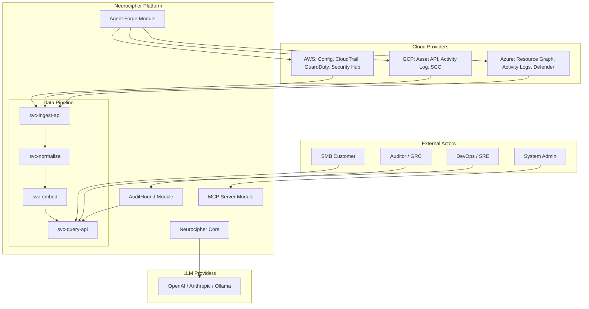

# ARC-001 Platform Context and Boundaries

## 1. Purpose

This document defines the system context, external actors, trust boundaries, and
high-level integration points for the Neurocipher platform.

It exists to:

- Establish what is inside and outside the platform boundary.
- Identify all external systems, actors, and data flows.
- Define trust boundaries for security analysis (SEC-001).
- Provide the canonical context diagram referenced by all module architectures.

-----

## 2. Scope

This document covers:

- Platform boundary definition.
- External actors (human and system).
- Cloud provider integrations (AWS, GCP, Azure).
- Third-party service dependencies.
- Trust boundary classifications.

This document does not cover:

- Internal module architecture (see CORE-001, AH-001, AF-001, MCP-ARCH-001).
- Data model specifics (see DM-003, DM-004, DCON-001).
- Detailed API contracts (see DPS-API-001, openapi specs).

-----

## 3. References

- REF-001 Glossary and Standards Catalog
- REF-002 Platform Constants
- SEC-001 Threat Model and Mitigation Matrix
- PRD-002 Capabilities and Module Mapping

-----

## 4. System context diagram



-----

## 5. External actors

|Actor        |Type  |Interaction                                 |Trust Level                 |
|-------------|------|--------------------------------------------|----------------------------|
|SMB Customer |Human |Dashboard, reports, configuration           |Authenticated, tenant scoped|
|Auditor / GRC|Human |Compliance reports, evidence export         |Authenticated, read only    |
|DevOps / SRE |Human |Alerts, remediation approvals               |Authenticated, action scoped|
|System Admin |Human |Platform configuration, user management     |Authenticated, admin scoped |
|AWS APIs     |System|Config, CloudTrail, GuardDuty ingestion     |External, credential scoped |
|GCP APIs     |System|Asset API, Activity Log, SCC ingestion      |External, credential scoped |
|Azure APIs   |System|Resource Graph, Activity, Defender ingestion|External, credential scoped |
|LLM Providers|System|Risk analysis, report generation            |External, API key scoped    |

-----

## 6. Trust boundaries

|Boundary           |Classification     |Controls                                                       |
|-------------------|-------------------|---------------------------------------------------------------|
|Platform perimeter |High trust internal|mTLS, JWT validation, tenant isolation                         |
|Cloud provider APIs|External untrusted |Credential rotation, least privilege IAM                       |
|LLM provider APIs  |External untrusted |No PII transmission (P1/P2 per REF-001 §8.1), output validation|
|Customer browser   |External untrusted |HTTPS, CSP, input validation                                   |

-----

## 7. Services and storage (per REF-002)

### 7.1 Services

|Service          |Name                  |ECR Repository                                 |
|-----------------|----------------------|-----------------------------------------------|
|Ingest API       |`svc-ingest-api`      |`ecr.us-east-1.amazonaws.com/nc/svc-ingest-api`|
|Normalize workers|`svc-normalize`       |`.../svc-normalize`                            |
|Embed workers    |`svc-embed`           |`.../svc-embed`                                |
|Query API        |`svc-query-api`       |`.../svc-query-api`                            |
|Security Actions |`svc-security-actions`|`.../svc-security-actions`                     |

### 7.2 Storage

|Type                  |Pattern                       |
|----------------------|------------------------------|
|Raw bucket            |`s3://nc-dp-{env}-raw`        |
|Normalized bucket     |`s3://nc-dp-{env}-norm`       |
|Schema bucket         |`s3://nc-dp-{env}-schema`     |
|Documents table       |`nc-dp-{env}-documents`       |
|Security actions table|`nc-dp-{env}-security-actions`|

### 7.3 KMS aliases

|Alias                       |Purpose                         |
|----------------------------|--------------------------------|
|`alias/nc-dp-data-{env}`    |Data encryption for S3, DynamoDB|
|`alias/nc-dp-schema-{env}`  |Schema registry signing         |
|`alias/nc-dp-security-{env}`|Security Engine command payloads|

-----

## 8. Key integration points

|Integration         |Direction|Protocol             |Contract Location|
|--------------------|---------|---------------------|-----------------|
|AWS Config          |Inbound  |AWS SDK, EventBridge |ING-002          |
|CloudTrail          |Inbound  |S3 + SNS             |ING-002          |
|GuardDuty           |Inbound  |EventBridge          |ING-002          |
|GCP Asset API       |Inbound  |Cloud Asset API      |ING-002          |
|Azure Resource Graph|Inbound  |Azure SDK            |ING-002          |
|OpenAI / Anthropic  |Outbound |HTTPS REST           |AI-001           |
|Customer Dashboard  |Outbound |HTTPS REST, WebSocket|DPS-API-001      |
|Agent Forge to Cloud|Outbound |Cloud SDKs           |AF-001           |

-----

## 9. Required resource tags (per REF-001 §6.1, REF-002)

All platform resources must include:

```json
{
  "Project": "Neurocipher",
  "Service": "svc-ingest-api",
  "Env": "prod",
  "Owner": "team-platform",
  "Compliance": "SOX|GDPR",
  "DataClass": "Confidential"
}
```

-----

## 10. Acceptance criteria

This document is complete when:

- [ ] All external actors are enumerated with trust levels.
- [ ] All cloud provider integrations are listed with protocol and contract reference.
- [ ] Trust boundaries are mapped to SEC-001 threat model.
- [ ] Context diagram is validated by Architecture Board.
- [ ] All module architects can trace their boundaries to this document.
- [ ] Service names match REF-002 constants.
- [ ] Storage patterns match REF-002 constants.

-----

## 11. Open questions

- [ ] Confirm LLM provider list (OpenAI, Anthropic, local Ollama).
- [ ] Define tenant isolation model (database level or row level).
- [ ] Confirm whether MCP server is customer facing or internal only.

-----

## 12. Revision history

| Date       | Author            | Change              |
| ---------- | ----------------- | ------------------- |
| 2025-11-26 | Architecture Lead | Initial Tier-1 stub |